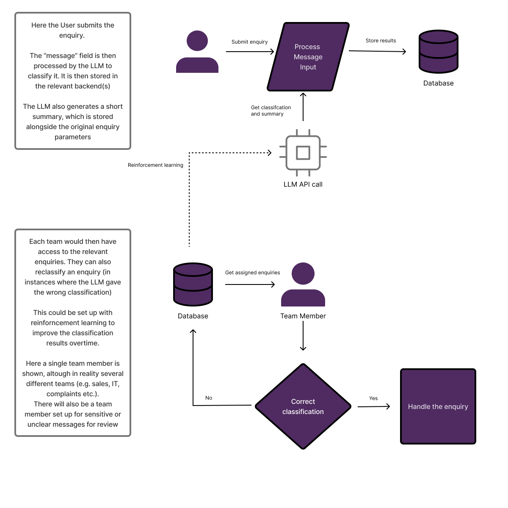

# Customer Enquiry Routing & Automation Prototype

A lightweight prototype built for the Graduate AI & Automation Engineer Technical Exercise. This system automates the intake, classification, and summary generation of customer enquiries using Node.js, TypeScript, and OpenRouter (Llama 3), providing a clean web dashboard for team routing and manual reviews.

---

## System Architecture & Flowchart

The diagram below illustrates how incoming website messages flow through the local server controller, get parsed and structured by the OpenRouter LLM API, persist to a mock database cache, and render on the team dashboard.

The flowchart shows how a real world deployment could work. For the sake of this task, several features have been simplified. These include, not requiring a SQL database and not using reinforcement learning. For more information see the section on limitations below.

---

## Tools & Approach

* Node.js & Native HTTP: Selected to build a lightweight server with zero heavy framework bloat, keeping the project fast and transparent.
* TypeScript: Ensures type safety for categorization (Sales, Support, Complaint, Manual Review) and data contracts.
* OpenRouter API (Llama 3): Chosen to handle natural language understanding cost-effectively without requiring local hardware weights or paid OpenAI account setups.
* JSON File Caching (process.json): Acts as a local mock database to ensure persistent storage across server sessions and fast page load speeds.

---

## How to Run the Prototype

### Prerequisites
* Node.js installed on your system.
* A free API key from OpenRouter (https://openrouter.ai/).

### Setup Steps

1. Clone or download the repository and cd into it
   
2. Install dependencies:
   npm install

3. Export your OpenRouter API key as an environment variable:
   
   * Linux / macOS:
     export OPENROUTER_API_KEY="sk-or-v1-your-api-key-here"
     
   * Windows (PowerShell):
     $env:OPENROUTER_API_KEY="sk-or-v1-your-api-key-here"

4. Start the development server:
   npx tsx server.js

5. Open the Dashboard:
   Navigate to http://127.0.0.1:3000/ in your web browser.

---

## Features Demonstrated

* AI Categorization: Automatically classifies text into Sales, Support, Complaint, or Manual Review.
* Structured Summaries: Generates clean, one-sentence core summaries for quick staff scanning.
* Interactive Dashboard: Includes an "All" tab, individual team queue views sorted chronologically (newest messages first), and a detail modal pop-up on click.
* Dynamic Form Submission: Features a "+ Submit New" tab allowing users to test live LLM processing on custom input messages.

---

## Assumptions, Limitations & Human-in-the-Loop

* Human Review Policy: Any ambiguous, sensitive, or high-risk message is routed explicitly to the Manual Review queue to ensure human oversight before taking action.
* Current Limitations: Uses a flat-file JSON cache (process.json) instead of an enterprise SQL database, and relies on public API rate limits.
* Production Improvements Before Launch: 
  1. Migrate from flat JSON storage to a relational database (e.g., PostgreSQL).
  2. Implement asynchronous background worker queues (e.g., Redis/BullMQ) to handle high volumes of incoming enquiries without blocking HTTP response times.
  3. Add role-based access control (RBAC) authentication for internal staff teams.
 
## Other notes

* Currently the initial enquiries.json has been preprocessed and saved to process.json. If you would like to process all enquiries from scratch, please delete process.json. Warning, due to processing constraints it may take a while for the webpage to load.
* In a realworld deployment, reinforcement learning is not strictly required (and may be difficult to implement if not using a local LLM. It would also likely only be useful for large business where the volume of enquiries is sufficient to affect the model's retrained weights.
* A realworld deployment may also require the use of other API and services, for instance sending processed enquiries to a ticketing system.

